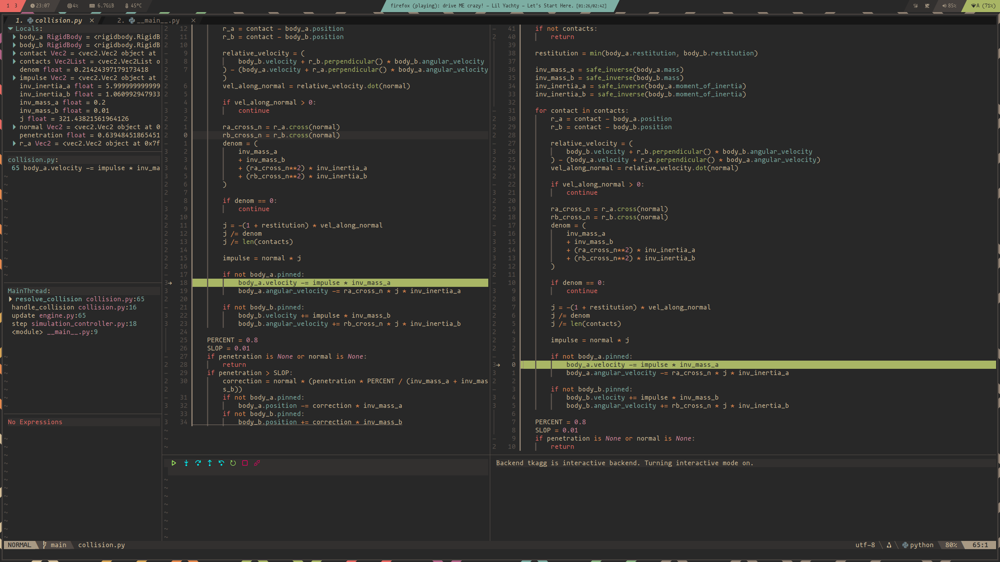
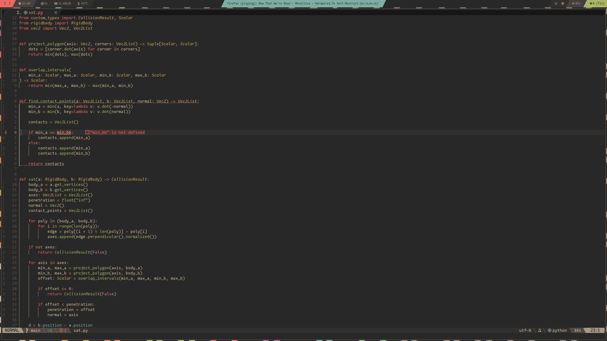

# Requirements
## Brief
I intend to develop an application for high school and primary school students to learn concepts about physics. These concepts can be as basic as newton's laws of motion, or as complicated as collision resolution. It will feature a lesson panel and a simulation where arbitrary convex polygons can be moved, collided and spawned to demonstrate semi-realistic physics laws. The lessons and the initial state of the canvas will be defined using parsed markdown files, which will allow for declarative code logic with imperative lesson building.

Physics is a complicated topic, with large amounts of prerequisite knowledge and equations. This can be overwhelming for some people, and for others who understand more complicated elements of physics, but don't fully grasp the fundamentals. However, as physics is such a universal topic, covering all topics and concepts in one application is infeasible.

Instead, my application will focus on basic physics principles, including the law of conservation of energy, newtons laws of motion and gravity. It will separate each concept into a separate "lesson", which will contain simple dot points on each topic; the aim of this application is to learn by example, not by rote. The lesson will define the principle, and provide relevant equations for calculating this.

The main feature of any given lesson will be the "simulation". The simulation will be next to the lesson, and take up approximately 2/3 of the total application width. Each simulation will be able to have two dimensional polygons placed within it, and they will collide with each other and the bounds of the simulation. This will be updated in real time to simulate natural motion, but disregarding complicated variables such as air resistance and friction. Each body will be considered "rigid", which simply means that it cannot be "broken" as a soft body would. This decreases the complication of implementing and handling collision by a *massive* amount.

Objects will be able to be pinned in place, and dragged around. Their velocity will change relative to the movement to allow "throwing". This is useful for demonstrating concepts such as the law of conservation of energy and newton's laws of motion.

Scene based variables such as gravity, which will be assumed to be relative to the y axis, can be varied using sliders to demonstrate the effects of gravity on bodies. When an object is pressed, a properties panel next to the simulation will display useful information such as velocity, mass, weight, restitution (elasticity) and other relevant information. Other informational toggles such as velocity component arrows will be provided for demonstratory purposes.

Having the scene information defined in a markdown file reduces the amount of formatting required to be done in a python file, which reduces the need for long, cumbersome strings. It also enables individuals to write their own lessons without needing knowledge of python; just markdown.


## Requirements
My application should:
- Have a graphical user interface (gui)
- Display an introductory screen, with information on how to navigate lessons and use the simulations
- Allow switching between lessons
    - A lesson is comprised of an information panel, and re-useable simulation canvas
- Simulate the motion of rigid bodies in real time with variable gravity and other parameters
- Update smoothly
- Handle user inputs such as pausing, playing, resetting, creating new shapes, and changing gravity
- Allow dragging shapes
- Detect and resolve collisions
- Read in lesson "instructions" from a markdown file
    - Render objects on the canvas from the metadata of the file
    - Create labels, images and equations using the main markdown text
- Allow visualising force components

## Design
### Abstract
#### Aesthetics/Quality
- Code will be written according to python [pep8](https://peps.python.org/pep-0008/) and [google's](https://google.github.io/styleguide/pyguide.html) styleguides
    - Consistent formatting
    - snake_case variable naming
    - CamelCase classes
- Follow the object oriented paradigm where possible
- Use type annotation for both variables and function returns
- Avoid redundant code
- Minimize use of libraries
- Avoid redundant comments; focus on readable code

#### Function
- Each function accomplishes one thing
- Related functions grouped in one module
- Avoid dictionary returns; use named classes or tuples
- Modular; use interfaces to allow swapping of algorithms
- Use pythonic code principles
- Re-use code where possible
- Generic classes

### Specific
#### General
- Use tkinter for the interface
    - Use dynamic tkinter ttk where applicable
- Create classes for application elements
- Create vector classes with applicable calculatory methods

#### Parser
- Recursively open all markdown files in a directory for reading
- Iterate through each file
- Iterate through each line in the file
- Process and check for defined markdown elements such as headings and bullet points
    - Use regular expressions to simplify code and improve performance
    - Detect LaTeX maths expressions and render them as images using matplotlib
- Define cases for markdown elements to be different text sizes and styles
- Parse properties denoted by a `---` block and read in yaml-style inline object properties for rendering on the canvas
    - Ensure sanitzation
- Render discovered text and elements in a tkinter frame
- Use os.path.join for cross-platform compatability

#### Interface
- Display lesson frame next to canvas
- Allow resizing the canvas based on window size; update bounds
- Create buttons that pause the simulation
- Allow resetting canvas on switching lessons

#### Simulation
- Choose a collision algorithm; sat/gjk
    - Performance testing
- Create a function to draw polygons as a set of vertices
- Store individual object data in a rigidbody class
- Store objects in an engine class
- Step the simulation based on a time delta
- Calculate the new position of objects given properties and velocity over the time step
- Check for collisions between objects
- Resolve bad collisions by updating velocity and position
- Enforce bounds by defining "object" walls
    - Resize bounds based on canvas dimensions
- Draw non-existent shapes found in engine
- Change coordinates of existing shapes by calling their method to return vertices
- Setup handlers using tkinter event handlers for dragging and mouse movement

## Specifications
- Developed on and for linux, needs to run on windows, not going to be tested for macos
- Target python versions 3.12 and above for type annotation
- tkinter library required
- matplotlib library required
- Should work across various screen sizes
markdown.


# Design
Please zoom in on the provided charts. Source files are provided under `src/`.

## Flowchart


## Structure


# Datatypes
*What is a datatype?*

In programming, a datatype is a classification used to determine what type of data a given variable can store. The type of data influences how the variable can be manipulated, including what methods (operations) can be performed. Different datatypes have different purposes, hence why there is no "one" universal datatype. In theory, a universal datatype could be possible, but would be infeasible due to performance optimizations when working with specific types of data. 

Python has several builtin datatypes, including but not limited to;
- int (integer)
    - `1, 2, -100`
- float (floating point number)
    - `1.0, 2.0, -100.995, float('inf')`
- complex (complex numbers, with j referencing the imaginary unit)
    - `1 + 2j`
- str (string)
    - `"foobarbaz"`
- list (collection of variables, mutable *(entities can be modified after creation)*)
    - `[1, 2, 3], ['foo', 'bar', 'baz']`
- tuple (collection of variables, immutable *(entities cannot be modified after creation)*)
    - `(1, 2, 3), ('foo', 'bar', 'baz')`
- dict (dictionary)
    - `{'foo': 'bar', 'baz': 1}`
- bool (boolean)
    - `True or False, 1 or 0`
- NoneType (None)

## Bool
A boolean value is the most fundamental datatype in programming, analogous across all programming languages; it is always either True or False, 1 or 0. It is the lowest abstraction in computing, where electrical impulses of high or low determine complex flow within a physical chip. All other datatypes can be said to be a collection of boolean values, or binary. For the purposes of this, and in the case of python, bool is simply used to store a binary True or False. The primary use case for boolean values is in logic control. For example, a simple if statement evaluates an expression and diverts the flow logic based on the boolean outcome:

```python
if var_a < var_b:
    print("var_a is less than var_b")
else:
    print("var_a is greater than var_b")
```

The if statement evaluates `var_a < var_b` using the relational operator `<`. The operator returns `True` if `var_a` is less than `var_b`, and `False` if the contrary is true. The if statement then proceeds with the code indented under the statement if that statement evaluated to `True`, and would proceed to the `else:` block if not.

Boolean values can be assigned to as variables. The previous example could be written as:

```python
result = var_a < var_b
if result:
    print("var_a is less than var_b")
else:
    print("var_a is greater than var_b")
```

And would yield the same results.

Binary operations can be performed on boolean values in python:

```python
a = True
b = False
c = True

print(a and b) # False (AND)
print(a or b) # True (OR)
print(not a) # False (NOT)
print(a ^ b) # True (XOR)
print(a ^ c) # False (XOR)
```

- `AND` returns `True` if both variables are `True`, otherwise `False`
- `OR` returns `True` if either variable is `True`
- `NOT` negates the value of a variable, returning its inverse
- `XOR` or *Exclusive OR*, returns `True` if **exactly one** variable is `True`, and `False` is both are the same

The methods of many other datatypes will return boolean values, for example a string's `.isalpha()` will return `True` if the string is alphanumeric, and `False` otherwise. Hence, and even outside of the low level binary usage of boolean, it is clear how universal the datatype `bool` is in python.

My code uses boolean values extensively, primarily for flow and logic control, but also for binary parameter storing; such as through buttons.

## String
A string (`str` in python) is a sequence of characters. Unlike other programming languages such as C++, where strings are basically a list of characters, any given character is a string. Technically, a string is a single character, and hence the datatype is a string of strings, because a string can be indexed and sliced. Strings are commonly used for storing user input, and storing information to be displayed.

While strings can be modified using operators such as +, they are *immutable*, meaning their value cannot be changed after creation. Hence, an operator such as `+=`, which could be percieved as directly modifying the string, actually creates a temporary buffer that stores the old string, and the new value, then writes the buffer to back to the string. Because of this, using strings for any mathematical calculations or performant scenarios is not good practice.

However, the primary use case for strings (in python), is most likely user input and output. A string in python can represent any Unicode character, including emojis, letters, numbers and other special characters. This makes them a safe datatype for handling arbitrary user input without validation, or with delayed validation.

```python
var = string(input("Enter text: "))
foo = "foo"
bar = "bar"

print(foo + bar) # foobar
print(foo * 2) # foofoo
print(foo[0]) # f
print((foo+bar)[-1]) # r
```

In my project, strings are only used for label displays on text, applications and buttons, as well as for keys in dictionaries.

## Integer
An integer (`int` in python) stores whole numbers; they cannot contain any decimals. Unlike other programming languages such as C++ where integers have limited precision, which defines how many digits can be stored in a variable of certain type, dictated by the underlying binary, python's integers have unlimited precision (as of python 3). This means that integers can be arbitrarily large, without the need for type qualifiers such as `long`. Integers can be positive or negative.

Integers can be operated on mathematically, using all of the most common methods and operators:

```python
a = 1
b = 2

print(a+b) # 3
print(a-b) # -1
print(a*b) # 2
print(int(a/b)) # 0 (rounds back down)
print(a**b) # 1
# and so forth
```

Notice the statement where `int()` is called on the resultant of `a/b`. When we divide `a` and `b`, we get a floating point number. In the print expression, we assign it back to an integer using the function call `int()`. This will round it down to a whole number. It will never round up.

```python
print(int(0.9)) # 0
```

Integers can be used in complex mathematical calculations, but because of this limitation with rounding, you would never explicitly cast a floating point resultant back into an integer. Instead, the `round()` function should be used, where accuracy can be specified.

Python is *dynamically typed*, which in short means that variables cannot be explicitly assigned to a datatype; instead, they can change after declaration. Because of this, integers cannot be "relied" on as as a datatype for calculations, especially when dealing with arbitrary data, as python will in most cases convert it to a floating point at the end of an expression. In other languages such as C++, which is statically typed, you cannot assign floating point values to integers, allowing much more declarative and rigid code.

Hence, in my project, integers are primarily used as indexes into arrays, or for window coordinates that cannot be fractional. Compound datatypes (arrays, lists etc), as will be later explained, can return values given an index. These indices are *almost* always whole numbers.

_\*in a dunder \_\_iter\_\_ method for a custom class, you could define whatever datatype you want to, in order to index a value from a list_

## Floating point
A floating point number shares all of the same properties as integers, including most of the same methods and functions. The primary difference in python is that floating point numbers can have arbitrary decimal precision. Floating point numbers, like integers, have unlimited precision.

```python
a = 0.1
b = 0.5
infinity = float('inf')

print(a+b) # 0.6
print(infinity) # inf
print(infinity/2) # inf
print(infinity*0) # nan
```

Notice the `float('inf')` casting. This is a special datatype that has infinite value. It is very useful for calculating the lowest value, as nothing can be higher than it. It is used in my code to calculate a lowest value:

```python
penetration = float('inf')

# ...
for value in something:
    offset = some_calculation

    if offset < penetration:
        penetration = offset
    # ...
```

I assign penetration infinity, and then traverse through a list to determine the lowest value for offset that is less than penetration. This could be achieved by setting penetration to an arbitrarily high number, like `99999`, but this does not account for a scenario where offset is initially potentially higher.

Otherwise, floating points are used very frequently through my code, to store everything from gravity constants to restitution to delta times to times in nanoseconds.


## Lists
A list, or vector in C++, is a datatype that can store any other datatypes. It is a "container", where any element inside the list can be retrieved and indexed by its offset from the beginning. As touched on previously, a string is technically a list, as you can index any character in a string with its index, and preform most of the list operations on it. In python, list indices begin at 0 and continue for each entry in a list. It is created using square brackets.

```python
foo = ["b", "a", "r"]
print(foo[0]) # b
print(foo[1]) # a
print(foo[-2]) # a
print(foo[0:-1]) # a
```

A list item can be retrieved front to back using negative indices. It can also be "sliced" with `:`, which returns elements in a range. 

New variables can be assigned to existing values:

```python
foo = ["b", "a", "r"]
print(foo[0]) # b
foo[b] = "c"

print(foo[0]) # c
```
Elements can also be appended with the method `list.append()`, and removed with `list.pop(index)`. Popping an element out of the list will return it back.

Lists are very useful when order matters and you need to return something by its index. Iteration through elements is simple, and the order will stay the same. However, removing elements from a position in the list can be impactful on performance, as python has to iterate through the entire list in order to move other elements down.

Lists are used frequently throughout my application, for storing sequential vertices in a shape, bodies in an engine and more, where repeatable, sequential and indexable access is required.

## Tuple
A tuple is similar to a list in the sense that data can be retrieved by its index. However, tuples are immutable, so elements cannot be removed or added after creation. This is the main difference between the two.

Their immutability has a few benefits over lists. Because their size is set at declaration, searching through elements by index is faster with lists, especially with an increase in items. They can also be used for dictionary keys, which will be explained later.

```python
foo = ("a", "b", "c")
print(foo[0]) # a
print("b" in foo) # True
foo.pop(0) # error
```
Tuples are not used in my application, as all lists need to be dynamically allocated and modified due to the "updating" nature of a physics engine. There is one case where a tuple could be used inside a custom class, and in one instance it would improve performance, but to re-use code a list will suffice.

## Dictionary
A dictionary, or `dict` in python, is an ordered list where each item is indexed by a unique value, known as a key-value pair. Only immutable values can be used for keys, which means that lists and other dictionaries cannot be used in the key field.

```python
foo = {"big": True, "bar": "yes"}
print(foo["big"]) # True
```

In the above example we return the value given a key. We cannot index an item in a dictionary given an index, unless the key is numerical, unless we iterate over all elements:

```python
foo = {"big": True, "bar": "yes"}
counter = 0
target = 1
for key, value in foo:
    if counter == target:
        print(key, value)
        break
    counter += 1
```

For obvious reasons, this is not very performant. However, it is not an issue when you consider the types of data that is commonly stored in a dictionary; properties, pairings and more.

A common use case for a dictionary, and one that is used in my application, is storing a list of dictionaries:
```python
some_list = []

for i in range(10):
    some_list.append({"index": i, "value": f"foobar+{i}")

print(next(item['value'] for item in some_list if item['index'] == 1)) # foobar1
```

## Custom
Custom datatypes are very powerful. They allow you to aggregate multiple other datatypes and control which methods do what with the data, making using them highly declarative. This can be accomplished in python using the `class` keyword, and similarly in other programming languages.

```python
class Dog:
    def __init__(self, name, breed, weight, age):
        self.name = name
        self.breed = breed
        self.weight = weight
        self.age = age

    def get_age(self, dog=False):
        if not dog:
            return self.age
        if self.age <= 2:
            dog_years = self.age * 10.5
        else:
            dog_years = 21 + (self.age - 2) * 4
        return dog_years

dog_1 = Dog("otis", "German Shorthaired Pointer", 35, 2.5)
print(dog_1.name) # otis
print(dog_1.get_age(dog=True)) # 23.0
print(class(dog1)) # <class '__main__.Dog'>
```

This is a simple example of a custom datatype. We can set parameters in the dunder `__init__` (double underscore), which is a *magic method*, being a constructor. We can then define other arbitrary methods for manipulating, validating or returning our data.

```python
type Scalar = int | float
class Vec2:
    def __init__(self, x: Scalar = 0.0, y: Scalar = 0.0):
        self._x: Scalar = x
        self._y: Scalar = y

    #...

    def __add__(self, other: Vec2) -> Vec2:
        return Vec2(self._x + other.x, self._y + other.y)
```

The above code is a more complicated example, and an excerpt from my program. It is intended to store vectors, which is an object that contains magnitude and direction. This is generalised to improve re-usability.

We can annotate types using `varname: type = variable`, which informs python's type checker what datatype should be stored in a variable, and can help with lsp errors. It also improves the readability of code by defining what a variable might be, or what a function might return.

A custom type can be defined using the `type` keyword, which is builtin as of python version 3.12. Here, we define a `Scalar`, which is a single numerical value; having only magnitude and no direction. We can specify that we want either an integer or a floating point number using the union type (`|`).

Notice the `__add__` method. This is another magic method, and it instructs python on how to handle addition with a custom class. Here, we allow addition by summing the respective `x` and `y` properties of the new value, and return it.

This would allow us to do the equivalent of:

```python
a = Vec2(1, 2)
b = Vec2(1, 3)

c = a+b

print(c.x, c.y) # 2, 5
```

While this is a basic example, my code extends this greatly to allow various complicated vector operations, which greatly simplifies code and improves legibility over disjointed functions.

As is probably obvious, custom datatypes are crucial to my code, but not absolutely critical. We could have used a list for `a` and `b`, but this is less readable, declarative and clean. Hence, they are used widely throughout, where builtin types won't suffice.

## Date and time
Date and time could store a date in a given format based on locality. However, python does not have a built in date or time datatype, rather it is provided by the python module datetime.

```python
from datetime import datetime, timedelta
dt = datetime(2008, 11, 15, 12, 30)

print(dt) # 2008-11-15 12:30:00
print(dt + timedelta(days=16 * 365)) # 2024-11-11 12:30:00
```

This allows for operations given dates and times, and would be useful for time-based records or timewise operations. In my application, I do not use the datetime module.

Instead, I do use time based operations, but they are stored as floating point numbers; representing milliseconds and nanoseconds.

```python
import time
time_ = time.perf_counter_ns()
# some execution logic
print(time_)  # 138851434332218

```

This function of the time module will return a nanosecond timestamp using the underlying operating systems best and most accurate clock. It measures millisecond offset from the start of program execution, which means it will never go backwards. Hence, it is very useful for calculating precise measurements of time. I use it in my program to determine how far a mouse cursor has moved over a given point in time to determine velocity ($v = d/t$). However, it is not actually a datatype, and uses integers for storage.


## Real
A real number is any number that can be placed on an infinite number line. It includes rational and irrational numbers, where rational numbers can be expressed as fractions and irrationals can't. It can be either negative or positive, with infinite precision. It encompasses all numbers besides irrational, complex and special numbers such as infinity.

It is very useful as a broad "valid number" datatype. In python, Real is not considered a datatype on its. Own. However, it can be created as a type definition for simplicity sake. Type annotation in short tells python what datatype is expected of a function return or variable. It is not a requirement.

```python
type Real = int | float

somenumber: Real = 0.9999
somenumber += j # still works
```

However, if ensuring that **only** real numbers is stored within a variable, a custom Real class could be created:

```python
class Real:
    def __init__(self, value: float):
        self.value = value

    @property
    def value(self) -> float:
        return self._value

    @value.setter
    def value(self, new_value: float):
        if not isinstance(new_value, (int, float)):
            raise ValueError("Value must be a real number (int or float).")
        self._value = float(new_value)
```

Here we define a property and a setter using a method and a decorator. By creating a method with the same name as a property, we can control exactly what can and can't be assigned to the variable. We define two methods, as python supports overloading of functions, so calling `var.value` will be different to `var.value = foo` and will call the relevant functions. This is furthered by the decorators specified by `@`, which informs language servers (extensions) that the property is defined by the setter and the property. It can then enforce the logic found in the if statement within the setter, which ensures that the new set value will be either an integer or a float.

## Array
An array is analogous to a list.

## Record
A record is a collection of related information. A product may contain related information about origin, price, nature etc. In python, there is no "Record" per-se, however the closest datatype would be a dictionary which is defined above. A named tuple can also be used to explicitly define properties for a tuple:

```python
from collections import namedtuple

Student = namedtuple('Student', ['name', 'age', 'DOB'])

S = Student('Arthur', '16', 2008)

print(s.name) # Arthur
```

This could also be achieved with a custom class.

A record is very useful for storing related data and retrieving it later. In the above example, student records could be stored in a list, and individual fields can be returned. In my program, I don't explicitly use records or named tuples in my application, but the concept of a record is used to store rigid body properties.

## Trees
A tree is a hierarchical abstract datatype that consists of nodes (vertices) connected by edges. It can be considered a "tree" because it contains leaves and branches. Each node can be connected to other nodes and form a branch-like structure.
```
        Root
       /    \
   Child 1   Child 2
   /    \
Child 1.1 Child 1.2
```

The topmost node is known as the root, and the bottom nodes with no children are considered "leaves". Because of the hierarchical structure of trees, they are excellent for representing relationships between data. For example, a filesystem directory structure could be stored as a tree, which would allow traversal and calculation of "depth" based on the number of node relationships. Trees and tree-based algorithms are prevalent in many builtin python functions, including the dictionary datatype which is actually stored like a tree. However, there is no user-facing tree datatype. Instead, it could be created using node and tree classes:

```python
class TreeNode:
    def __init__(self, value):
        self.value = value
        self.children = []

    def add_child(self, child_node):
        self.children.append(child_node)

class Tree:
    def __init__(self, root_value):
        self.root = TreeNode(root_value)
    # ...
```

I do not explicitly use trees in my application, with the exception of dictionaries, as the nature of my application does not lend itself to it.

## Sequential and random files
Sequential files refer to files that are accessed sequentially (linearly), which means that data is written or read in a specific order, generally from top to bottom. They contrast with random access files, which allow seeking to any point in the file without reading the previous lines. Sequential file operations are typically preferred for larger files, as reading and writing can be optimized in single streams; reducing the need for seeking to different spots in the file. However, for random access, as the name implies, random access files are more performant than sequential files, but they do have added overhead. This is the premise of sequential access memory (sam), but physical media using sam is more uncommon and typically limited to specific cases such as magnetic tape drives, where data can only be accessed linearly. Modern storage media almost exclusively uses random access memory, and so does computer memory.

In python, files can be read either sequentially or randomly using the builtin `open` function, but sequential access is much more common:

```python
with open('foobar.txt' 'w') as file:
    for line in file:
        print(line, end="")

    file.write("baz")
```

Using the `with` keyword when calling open is best practice as python will handle closing the file when all operations are complete. This is important, as in the name of optimization, python may not always write changes to files immediately, instead waiting for a buffer to fill up and writing out the entire buffer to the file.

We can also write content to a file. Again, once execution within the `with` statement finishes python will close the file. This is the same as calling `file.close()`.

I use sequential files in my application to read in lesson content from markdown files, however it is readonly, and uses the `.read()` method on the file to assign its contents to a variable.

# Data Dictionary
\begin{table}[!ht]
    \centering
    % Resize the table so its width matches \textwidth; height is scaled proportionally (!)
    \resizebox{\textwidth}{!}{%
        \small
        \begin{tabular}{|l|l|l|l|l|l|l|}
        \hline
            \textbf{Variable} & \textbf{Type} & \textbf{Format} & \textbf{Size} & \textbf{Description} & \textbf{Example} & \textbf{Validation} \\ \hline
            Width & Int & ~ & 28 & Width of the canvas in pixels, updated each step. & 1920 & ~ \\ \hline
            Height & Int & ~ & 28 & Height of the canvas in pixels, updated each step. & 600 & ~ \\ \hline
            DELTA & Float & ~ & 24 & Time step in milliseconds; updates simulation after this delay. & 0.016 & ~ \\ \hline
            SPEED & Int & NN & 28 & Multiplies delta time to adjust simulation speed. & 3 & ~ \\ \hline
            Running & Bool & ~ & 28 & Controls simulation updates; True allows logic to step. & True & ~ \\ \hline
            Canvas & Canvas & ~ & 16 & Canvas where bodies are drawn. & N/A & ~ \\ \hline
            Bodies & List & ~ & 16 & List of all RigidBodies for access. & [Body1, Body2] & ~ \\ \hline
            RigidBody & Custom & ~ & 16 & Contains properties of a rigid body. & \{'pos': <vec2.Vec2>, ...\} & ~ \\ \hline
            Vertices & Vec2List & ~ & 16 & Vector coordinates for a rigid body. & [<vec2.Vec2>, ...] & ~ \\ \hline
            Vector & Vec2 & [X, X] & 16 & Two-dimensional vector with x and y components. & [30, -200] & X and Y must be Scalar \\ \hline
            Vector.X & Scalar & XXX.XX & 28 & X component of the vector. & -0.321 & Must be Scalar \\ \hline
            Vector.Y & Scalar & XXX.XX & 28 & Y component of the vector. & -0.321 & Must be Scalar \\ \hline
            Position & Vec2 & [X, X] & 16 & Position of a rigid body at any time. & [300, 200] & ~ \\ \hline
            Velocity & Vec2 & [X, X] & 16 & Direction and magnitude of a rigid body’s velocity. & [100, 200] & ~ \\ \hline
            Angle & Scalar & XXX.XX & 28 & Absolute angle of a rigid body. & -365 & Must be Scalar \\ \hline
            Mass & Scalar & XXX & 28 & Mass of a rigid body. & 5 & Must be Scalar \\ \hline
            Restitution & Scalar & X & 28 & Elasticity coefficient; 0 is inelastic, 1 is elastic. & 0.5 & Must be Scalar, >= 0 and <= 1. \\ \hline
            Pinned & Bool & ~ & 28 & Indicates if a body is pinned; prevents updates to its position or rotation. & True & ~ \\ \hline
            Content & Str & ~ & 41 - ∞ & Unprocessed markdown text from a file; starts at 41 bytes if empty. & "foobarbaz \#foobar" & ~ \\ \hline
            Properties & Dictionary & ~ & 48 - ∞ & Property pairings from parsed metadata; includes scene and body info. & \{'sides': 4\} & ~ \\ \hline
            Img & Image & ~ & 16 & Rendered LaTeX image for drawing on the frame. & N/A & ~ \\ \hline
        \end{tabular}
    }
\end{table}


# Debugging
Debugging is the process of removing bugs found during the software development process. A bug is jargon for code behaving in an unintended manner, or failing to execute It originates back to punched cards; where the first bug existed due to a physical bug on a card producing an unintended result.

Sometimes, due to flawed logic or simple mistakes, code will fail to execute. In python, this typically results in an error being thrown. These errors may or may not terminate execution, depending on where in the process or subprocess it originated. Python generally has descriptive error messages as compared to other languages such as C++, so solving such errors is relatively straightforward.

```python
Traceback (most recent call last):
  File "/home/arthur/dev/python/software-task-1/__main__.py", line 7, in <module>
    app = Application(root)
          ^^^^^^^^^^^^^^^^^
  File "/home/arthur/dev/python/software-task-1/application.py", line 25, in __init__
    self.lesson_manager.load_lesson("intro.md")
  File "/home/arthur/dev/python/software-task-1/lesson_manager.py", line 56, in load_lesson
    self.lesson_frame.display_lesson(markdown_text)
  File "/home/arthur/dev/python/software-task-1/lesson_manager.py", line 25, in display_lesson
    self.parent.simulation_canvas.body_renderer.create_polygon(**properties)
  File "/home/arthur/dev/python/software-task-1/renderer.py", line 39, in create_polygon
    self.simulation_controller.physics_engine.bodies.add(body, canvas_id)
    ^^^^^^^^^^^^^^^^^^^^^^^^^^^^^^^^^^^^^^^^^^^^^^^^
  File "/home/arthur/dev/python/software-task-1/engine.py", line 19, in bodies
    return self._bodiess
           ^^^^^^^^^^^^^
AttributeError: 'Engine' object has no attribute '_bodiess'. Did you mean: '_bodies'?
```

As is shown, the exact line where the `AttributeError` was thrown is shown, and python additionally provides helpful suggestions on how to rectify this error.

```cpp
terminate called after throwing an instance of 'std::out_of_range'
  what():  vector::_M_range_check: __n (which is 1000) >= this->size() (which is 0)
fish: Job 1, './a.out' terminated by signal SIGABRT (Abort)
```

In the above example, which is a C++ runtime error, we are still presented with useful information, but it is much more cryptic than the python (although it is a different case). Additionally, as C++ is a compiled language, compilation or even runtime errors in a large project can waste resources and time, especially if the issue is as simple as an out of bounds pointer.

As shown in the above two examples, both errors are very straightforward to fix by just editing a line of code. However, it can be said that the most time consuming bugs don't throw verbose errors, instead they execute incorrectly; passing incorrect types, outputting incorrect information. It is with these that external tools (technically previous error messages are debugging tools) present themselves as a massive time save, allowing for rigorous disassembly and examination of code.

## Print statements
One of the most straightforward yet powerful debugging tools in python is the inbuilt `print` function. It simply prints a variable to the terminal. When there is a situation where code is not executing as expected, printing out a variable can help in narrowing down why and how the error occurred.

```python
def issamenumber(var_1, var_2):
    result = int(var_1/var_2)
    return True if result == 1 else False

print(issamenumber(4, 3.9)) # True
```
*this is a terrible way to do this, and is just an example*

We expect this to return False, as 4 and 3.9 are certainly not the same number. However, it returns True.

Without realising how float to integer conversion is handled in python, this is a frustrating error. It is not inherently obvious why these two numbers are considered the same.

```python
def issamenumber(var_1, var_2):
    result = int(var_1/var_2)
    print(var_1/var_2)
    print(int(var_1/var_2))
    return True if result == 1 else False

print(issamenumber(4, 3.9)) # 1.02..., # 1, True
```

It becomes pretty obvious after printing out the execution steps why it returns True and not False; calling `int()` on a floating point number rounds it down, no matter what. It is then clear that the solution to this problem would be to not cast the result back into an integer, and leave it as a float.

Print statements are also very useful when debugging classes and methods. Often times, when dealing with deep recursion of parent-child relationships, datatypes can be lost, especially if the variables are not well documented.

```python
command=self.simulation_canvas.simulation_controller.set_gravity
```

Without looking manually back through all relevant class initialization, it is not clear what this could be; is it a function (ignore the set directive)? What class does it belong to?

We can gather information using the print function:

```python
print(type(self.simulation_canavs.simulation_controller.set_gravity)) # <class 'method'>
```

While still not overwhelmingly helpful, it does present itself handy in situations when dealing with large applications. Printing out values can also be helpful where continuous streams of data are being passed between functions, in order to determine what can and will be passed and stored in variables.

## Breakpoints
A breakpoint is a point in code where execution is halted. Depending on the breakpoint tool and language it is being used on, you may be able to view contents of variables, proceed with line based stepping, or viewing memory (not usually applicable in python).

The simplest of breakpoints can be achieved using the `input()` function, which will wait until the Return key is pressed. This could be paired with printing out variables when inside a loop to avoid continuous printing to the terminal:

```python
def add(a, b):
    result = a + b
    if result < 0:
        print(a, b, result)
        input() # will pause execution at this point
    return result

for i in range(10):
    print(add(i, i+1))
```

Instead of printing out 10 different lines and searching for relevant ones, or having to backtrack, `input()` can stop the program until manual proceeding is desired. In the above instance, we want to see what the conditions would have to be for the result to be zero. Obviously, this statement is unreachable given the current range.

However, sometimes you need more granular and imperative debugging. This is where debugging modules can come in handy. In python, there are several options for interactive breakpoint debuggers, both as modules and extensions to popular code editors.

`pdb` is provided as a built in module within python, and is a simple, yet powerful tool.

```python
import pdb

def add(a, b):
    result = a + b
    if result >= 0:
        pdb.set_trace() # breakpoint
    return result

for i in range(10):
    print(add(i, i+1))
```

If the above condition is met, the pdb module will break at the specified point and drop into an interactive console. Various keybindings are available to step through code, continue until another breakpoint, as well as printing variables.

```python
> <stdin>(5)add()
(Pdb) p a
0
(Pdb) p b
1
(Pdb) p result
1
(Pdb) c
1
> <stdin>(5)add()
(Pdb) p a
1
(Pdb)
```

Here we reach the breakpoint, and print out the variables with `p variable`, then step to the next breakpoint with `c`. This can be very useful for debugging, and also incorporates line by line debugging.



This is another example of a debug program, Nvim-Dap/DapUI. However, this one is integrated into my code editor, neovim. Where the green line is, I have added a breakpoint. Upon running, the code is stopped at this breakpoint. I can then view local and global variables in a sidebar, handle stepping, evaluate expressions and more. It is a much more powerful alternative to pdb, but it requires more setup. I do not use vscode, but I am more than certain there are alternatives for vscode that are equivalent.

This plugin is very useful, and incorporates many debugging tools into one interface, including line stepping, breakpoints, watches.

## Watches
A watch is an interactive view of changing variables over a given time, or on a breakpoint. It can display both local (variables contained within a function or class), or global (variables visible from inside and outside a class) variables.

In the instance of my editor plugin, it displays the types of variables, as well as their values, and members if relevant. It can be seen in the above screenshot in the top left corner.

## Interfaces
An interface can be considered a function that passes variables in one or more direction between one or more functions. An interface is very useful in writing good code, as it enables each function to only "know" how the interface works, and not the other functions it has to work with. This allows code to be very modular, enabling modularity and easier debugging of values.

```python
def handle_collision(body_a, body_b, method="sat"):
    if method == "sat":
        result: CollisionResult = sat(body_a, body_b)
    else:
        return
    if result is not False:
        resolve_collision(body_a, body_b, result)
```
*we check for `is not False` and not just `True` as the sat's returned result is a custom class that can either be a list with first parameter True or a boolean False*

In this interface excerpt, we call two functions, and pass the result of one into the other given a condition. This could be "simplified" by calling `resolve_collision` directly within `sat`, but this would mean that an update to how either function passes its parameters breaks the other function/s. Additionally, validation of passing parameters can be enforced to ensure that the correct variables are being passed.

Formally, it is akin to a "contract", specifying what is required of various workers, and most importantly handling **consistency**. It does not care how one function achieves its goal, only that it outputs the required data and then it can pass it to another function.

In my example, I could replace the collision detection algorithm from SAT (separating axis theory) to GJK (Gilbert-Johnson-Keerthi), so long as it returns a value of class CollisionResult.

## Debugging output statements

While interfaces help ensure that functions communicate correctly by acting as formal contracts, debugging output statements are invaluable for verifying that variables maintain expected values throughout program execution. Debugging outputs help in isolating issues during development by printing intermediate results, variable states, or error information. They are especially useful when the logic becomes too complex for standard unit tests or when the error isn't immediately obvious.

For example, consider a scenario where a collision detection function produces unexpected results. By printing the intermediate collision data, you can quickly see if the objects’ properties (such as positions, velocities, or masses) are as expected before the collision is processed.

```python
def handle_collision(body_a, body_b, method="sat"):
    if method == "sat":
        result: CollisionResult = sat(body_a, body_b)
    else:
        return
    # Print details about collision result for debugging
    print("Debug: Collision result for handle_collision:", result)
    if result is not False:
        resolve_collision(body_a, body_b, result)
```

## Experience
Throughout the development of my application, I have faced various errors, as one would. However, most of my errors have been logic errors, rather than runtime or syntax errors. This is because I utilise lsp (language server protocols) plugins for my code editor, and use pyls (python language server). This runs checks during the editing of a file for syntax, formatting, and type checking.



### Syntax
In the above example, there is a clear typo. I could catch this in runtime, but it is very easy at a glance to determine that I have misspelled it thanks to my lsp. Additionally, using descriptive variable names can ensure that they are being used in the correct places. Hence, there were minimal runtime errors in my application.

In python, the main syntax errors occur due to missing colons (:) and indentation. These are very descriptive at runtime, but 9 times out of 10 I would catch things like these before running code, again due to my lsp highlighting the error. Additionally, my editor automatically handles indentation, and it is consistent using tabs set to 4 spaces. Using vim commands `<<` and `>>` in the editor with blockwise motions also makes indentation second nature.

### Logic
Logic examples are worse in the sense that language server protocols and runtime checks often cannot detect them; instead, they lie in how the code works, not that it doesn't, but that it works *incorrectly*.

In my program, I read in metadata from markdown "lesson" files that contain information about which objects to place in the simulation canvas. After making a slew of changes, I noticed that the bounds collisions were breaking; objects were phasing through the bounds as if it was jelly. I spent a few minutes analysing the collision algorithms, the engine, and rigidbody classes, all to no avail. A git diff with the previous commits also yielded no results.

It turned out that in the metadata I had accidentally added extra zeros to the mass of the objects, taking them from 5 kg to hundreds of tonnes. These kind of logic errors don't crash the program, but they cause it to behave incorrectly, and are very annoying. Having a granular version control system such as git has saved me countless hours in issues like these.


### Runtime
I did encounter several runtime errors in my development. This is because my application is heavily object oriented, using deep nested classes and such. Hence, the program could be deep into execution and meet a case that causes it to crash. This occurred several times when implementing the collision detection and resolution, as sometimes I accidentally preformed the wrong operation and threw an error within a class or similar. Often times the easiest way to quell runtime errors is to setup temporary try-except statements after an error.

```python
def somefunction(a: int, b: int) -> None:
  try:
    result = a / b
  except ZeroDivisionError:
    print(a, b)
    print(type(a), type(b))
  #...
```

Try-except statements are bad practice in production: they are temporary solutions to a problem that could be better fixed elsewhere. However, they are good for detecting and debugging thrown errors during execution. In the above example, we handle a case where b is zero. This raises an error, and we can then determine type of both variables, and their values. This is a basic example, but it can help in narrowing down the source of an error.

For further analysis, I would spawn a debug server and set a breakpoint in the except block, so I can investigate the source of variable `b`. I could use my editors search function to find all references to `somefunction`, and see if anything is passing incorrect parameters.

Type annotating using `variable: datatype` is also useful here as it tells python's type checker which datatype is expected of a variable. This can integrate with my lsp to display an error when I pass a variable to a function that expects another type. It is similar to the more declarative approach of a language such as C++ where you **must** set a datatype at variable creation, which is one of the reasons C++ and other compiled languages are preferred over python for most production scenarios.
