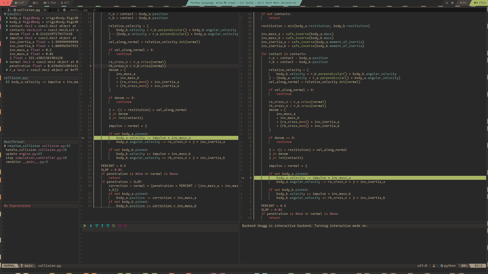
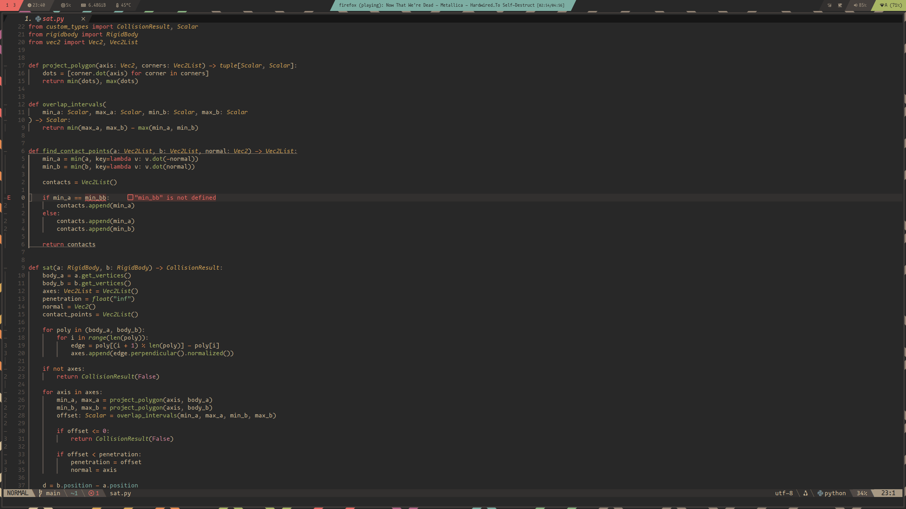

Debugging is the process of removing bugs found during the software development process. A bug is jargon for code behaving in an unintended manner, or failing to execute It originates back to punched cards; where the first bug existed due to a physical bug on a card producing an unintended result.

Sometimes, due to flawed logic or simple mistakes, code will fail to execute. In python, this typically results in an error being thrown. These errors may or may not terminate execution, depending on where in the process or subprocess it originated. Python generally has descriptive error messages as compared to other languages such as C++, so solving such errors is relatively straightforward.

```python
Traceback (most recent call last):
  File "/home/arthur/dev/python/software-task-1/__main__.py", line 7, in <module>
    app = Application(root)
          ^^^^^^^^^^^^^^^^^
  File "/home/arthur/dev/python/software-task-1/application.py", line 25, in __init__
    self.lesson_manager.load_lesson("intro.md")
  File "/home/arthur/dev/python/software-task-1/lesson_manager.py", line 56, in load_lesson
    self.lesson_frame.display_lesson(markdown_text)
  File "/home/arthur/dev/python/software-task-1/lesson_manager.py", line 25, in display_lesson
    self.parent.simulation_canvas.body_renderer.create_polygon(**properties)
  File "/home/arthur/dev/python/software-task-1/renderer.py", line 39, in create_polygon
    self.simulation_controller.physics_engine.bodies.add(body, canvas_id)
    ^^^^^^^^^^^^^^^^^^^^^^^^^^^^^^^^^^^^^^^^^^^^^^^^
  File "/home/arthur/dev/python/software-task-1/engine.py", line 19, in bodies
    return self._bodiess
           ^^^^^^^^^^^^^
AttributeError: 'Engine' object has no attribute '_bodiess'. Did you mean: '_bodies'?
```

As is shown, the exact line where the `AttributeError` was thrown is shown, and python additionally provides helpful suggestions on how to rectify this error.

```cpp
terminate called after throwing an instance of 'std::out_of_range'
  what():  vector::_M_range_check: __n (which is 1000) >= this->size() (which is 0)
fish: Job 1, './a.out' terminated by signal SIGABRT (Abort)
```

In the above example, which is a C++ runtime error, we are still presented with useful information, but it is much more cryptic than the python (although it is a different case). Additionally, as C++ is a compiled language, compilation or even runtime errors in a large project can waste resources and time, especially if the issue is as simple as an out of bounds pointer.

As shown in the above two examples, both errors are very straightforward to fix by just editing a line of code. However, it can be said that the most time consuming bugs don't throw verbose errors, instead they execute incorrectly; passing incorrect types, outputting incorrect information. It is with these that external tools (technically previous error messages are debugging tools) present themselves as a massive time save, allowing for rigorous dissasembly and examination of code.

## Print statements
One of the most straightforward yet powerful debugging tools in python is the inbuilt `print` function. It simply prints a variable to the terminal. When there is a situation where code is not executing as expected, printing out a variable can help in narrowing down why and how the error occurred.

```python
def issamenumber(var_1, var_2):
    result = int(var_1/var_2)
    return True if result == 1 else False

print(issamenumber(4, 3.9)) # True
```
*this is a terrible way to do this, and is just an example*

We expect this to return False, as 4 and 3.9 are certainly not the same number. However, it returns True.

Without realising how float to integer conversion is handled in python, this is a frustrating error. It is not inherently obvious why these two numbers are considered the same.

```python
def issamenumber(var_1, var_2):
    result = int(var_1/var_2)
    print(var_1/var_2)
    print(int(var_1/var_2))
    return True if result == 1 else False

print(issamenumber(4, 3.9)) # 1.02..., # 1, True
```

It becomes pretty obvious after printing out the execution steps why it returns True and not False; calling `int()` on a floating point number rounds it down, no matter what. It is then clear that the solution to this problem would be to not cast the result back into an integer, and leave it as a float.

Print statements are also very useful when debugging classes and methods. Often times, when dealing with deep recursion of parent-child relationships, datatypes can be lost, especially if the variables are not well documented.

```python
command=self.simulation_canvas.simulation_controller.set_gravity
```

Without looking manually back through all relevant class initalization, it is not clear what this could be; is it a function (ignore the set directive)? What class does it belong to?

We can gather information using the print function:

```python
print(type(self.simulation_canavs.simulation_controller.set_gravity)) # <class 'method'>
```

While still not overwhelmingly helpful, it does present itself handy in situtions when dealing with large applications. Printing out values can also be helpful where continuous streams of data are being passed between functions, in order to determine what can and will be passed and stored in variables.

## Breakpoints
A breakpoint is a point in code where execution is halted. Depending on the breakpoint tool and language it is being used on, you may be able to view contents of variables, proceed with line based stepping, or viewing memory (not usually applicable in python).

The simplest of breakpoints can be achieved using the `input()` function, which will wait until the Return key is pressed. This could be paired with printing out variables when inside a loop to avoid continuous printing to the terminal:

```python
def add(a, b):
    result = a + b
    if result < 0:
        print(a, b, result)
        input() # will pause execution at this point
    return result

for i in range(10):
    print(add(i, i+1))
```

Instead of printing out 10 different lines and searching for relevant ones, or having to backtrack, `input()` can stop the program until manual proceeding is desired. In the above instance, we want to see what the conditions would have to be for the result to be zero. Obviously, this statement is unreachable given the current range.

However, sometimes you need more granular and imperative debugging. This is where debugging modules can come in handy. In python, there are several options for interactive breakpoint debuggers, both as modules and extensions to popular code editors.

`pdb` is provided as a built in module within python, and is a simple, yet powerful tool.

```python
import pdb

def add(a, b):
    result = a + b
    if result >= 0:
        pdb.set_trace() # breakpoint
    return result

for i in range(10):
    print(add(i, i+1))
```

If the above condition is met, the pdb module will break at the specified point and drop into an interactive console. Various keybindings are available to step through code, continue untill another breakpoint, as well as printing variables.

```python
> <stdin>(5)add()
(Pdb) p a
0
(Pdb) p b
1
(Pdb) p result
1
(Pdb) c
1
> <stdin>(5)add()
(Pdb) p a
1
(Pdb)
```

Here we reach the breakpoint, and print out the variables with `p variable`, then step to the next breakpoint with `c`. This can be very useful for debugging, and also incorporates line by line debugging.



This is another example of a debug program, Nvim-Dap/DapUI. However, this one is integrated into my code editor, neovim. Where the green line is, I have added a breakpoint. Upon running, the code is stopped at this breakpoint. I can then view local and global variables in a sidebar, handle stepping, evaluate expressions and more. It is a much more powerful alternative to pdb, but it requires more setup. I do not use vscode, but I am more than certain there are alternatives for vscode that are equivalent.

This plugin is very useful, and incorporates many debugging tools into one interface, including line stepping, breakpoints, watches.

## Watches
A watch is an interactive view of changing variables over a given time, or on a breakpoint. It can display both local (variables contained within a function or class), or global (variables visible from inside and outside a class) variables.

In the instance of my editor plugin, it displays the types of variables, as well as their values, and members if relevant. It can be seen in the above screenshot in the top left corner.

## Interfaces
An interface can be considered a function that passes variables in one or more direction between one or more functions. An interface is very useful in writing good code, as it enables each function to only "know" how the interface works, and not the other functions it has to work with. This allows code to be very modular, enabling modularity and easier debugging of values.

```python
def handle_collision(body_a, body_b, method="sat"):
    if method == "sat":
        result: CollisionResult = sat(body_a, body_b)
    else:
        return
    if result is not False:
        resolve_collision(body_a, body_b, result)
```
*we check for `is not False` and not just `True` as the sat's returned result is a custom class that can either be a list with first parameter True or a boolean False*

In this interface excerpt, we call two functions, and pass the result of one into the other given a condition. This could be "simplied" by calling `resolve_collision` directly within `sat`, but this would mean that an update to how either function passes its parameters breaks the other function/s. Additionally, validation of passing parameters can be enforced to ensure that the correct variables are being passed.

Formally, it is akin to a "contract", specifying what is required of various workers, and most importantly handling **consistency**. It does not care how one function achieves its goal, only that it outputs the required data and then it can pass it to another function.

In my example, I could replace the collision detection algorithm from SAT (seperating axis theory) to GJK (Gilbert-Johnson-Keerthi), so long as it returns a value of class CollisionResult.

## Experience
Throughout the development of my application, I have faced various errors, as one would. However, most of my errors have been logic errors, rather than runtime or syntax errors. This is because I utilise lsp (language server protocols) plugins for my code editor, and use pyls (python language server). This runs checks during the editing of a file for syntax, formatting, and type checking.



### Syntax
In the above example, there is a clear typo. I could catch this in runtime, but it is very easy at a glance to determine that I have misspelled it thanks to my lsp. Additionally, using descriptive variable names can ensure that they are being used in the correct places. Hence, there were minimal runtime errors in my application.

In python, the main syntax errors occur due to missing colons (:) and indentation. These are very descriptive at runtime, but 9 times out of 10 I would catch things like these before running code, again due to my lsp highlighting the error. Additionally, my editor automatically handles indentation, and it is consistent using tabs set to 4 spaces. Using vim commands `<<` and `>>` in the editor with blockwise motions also makes indentation second nature.

### Logic
Logic examples are worse in the sense that language server protocols and runtime checks often cannot detect them; instead, they lie in how the code works, not that it doesn't, but that it works *incorrectly*.

In my program, I read in metadata from markdown "lesson" files that contain information about which objects to place in the simulation canvas. After making a slew of changes, I noticed that the bounds collisions were breaking; objects were phasing through the bounds as if it was jelly. I spent a few minutes analysing the collision algorithms, the engine, and rigidbody classes, all to no avail. A git diff with the previous commits also yielded no results.

It turned out that in the metadata I had accidentially added extra zeros to the mass of the objects, taking them from 5 kg to hundreds of tonnes. These kind of logic errors don't crash the program, but they cause it to behave incorrectly, and are very annoying. Having a granular version control system such as git has saved me countless hours in issues like these.


### Runtime
I did encounter several runtime errors in my development. This is because my application is heavily object oriented, using deep nested classes and such. Hence, the program could be deep into execution and meet a case that causes it to crash. This occurred several times when implementing the collision detection and resolution, as sometimes I accidentially preformed the wrong operation and threw an error within a class or similar. Often times the easiest way to quell runtime errors is to setup temporary try-except statements after an error.

```python
def somefunction(a: int, b: int) -> None:
  try:
    result = a / b
  except ZeroDivisionError:
    print(a, b)
    print(type(a), type(b))
  #...
```

Try-except statements are bad practice in production: they are temporary solutions to a problem that could be better fixed elsewhere. However, they are good for detecting and debugging thrown errors during execution. In the above example, we handle a case where b is zero. This raises an error, and we can then determine type of both variables, and their values. This is a basic example, but it can help in narrowing down the source of an error.

For further analysis, I would spawn a debug server and set a breakpoint in the except block, so I can investigate the source of variable `b`. I could use my editors search function to find all references to `somefunction`, and see if anything is passing incorrect parameters.

Type annotating using `variable: datatype` is also useful here as it tells python's type checker which datatype is expected of a variable. This can integrate with my lsp to display an error when I pass a variable to a function that expects another type. It is similar to the more declarative approach of a language such as C++ where you **must** set a datatype at variable creation, which is one of the reasons C++ and other compiled languages are preferred over python for most production scenarios.